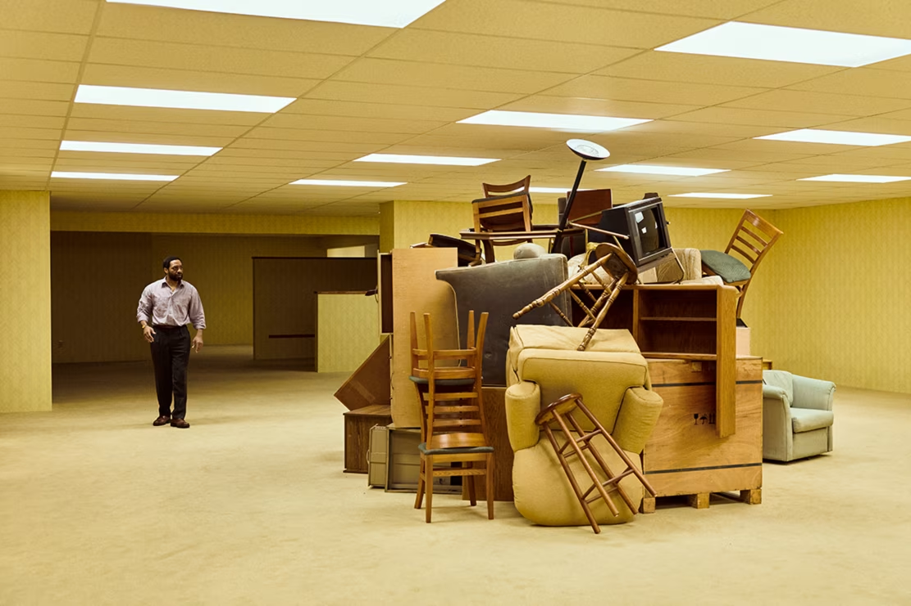
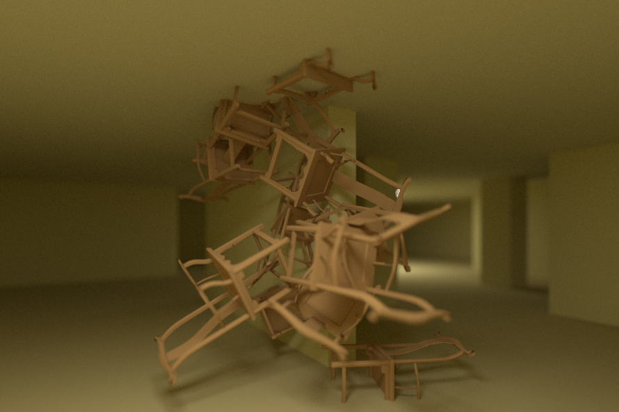
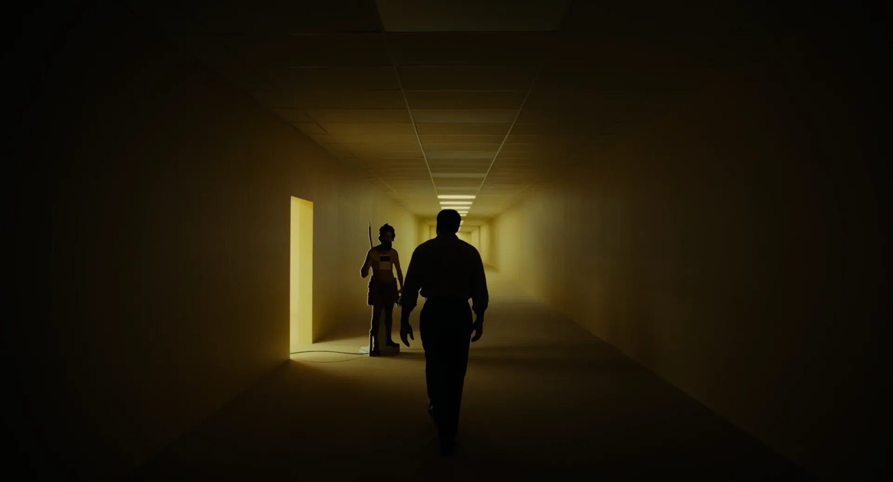
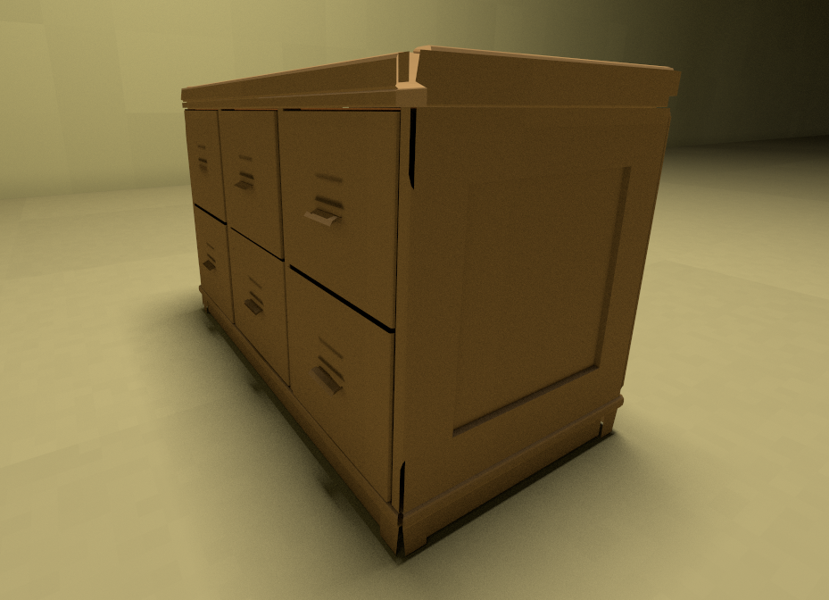
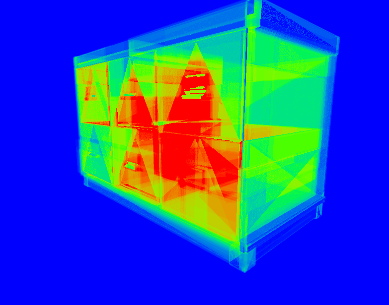
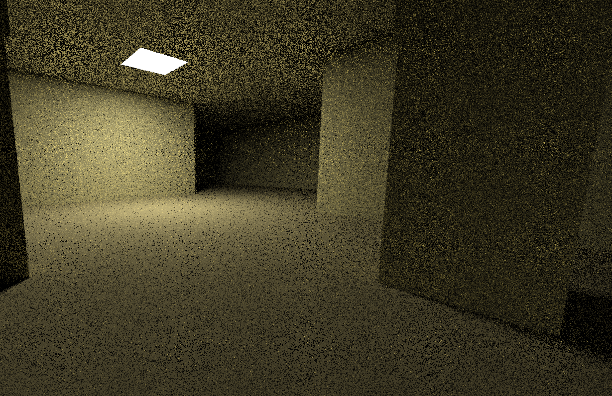
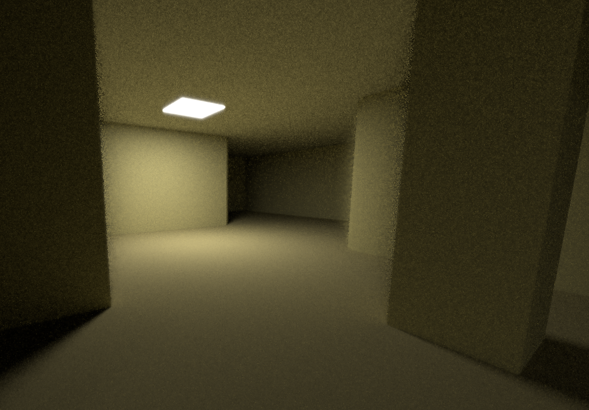
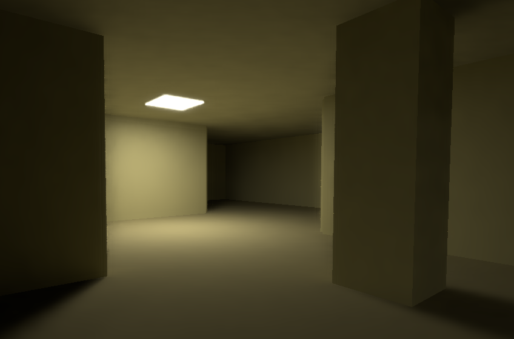

<div align="center">

# Tracing the Backrooms

### Path Tracing in Vulkan

<br>

<table border="0">
  <tr>
    <td align="center" width="50%">
      
      <br>
      <sub><strong>(a)</strong> Still from the movie <em>Backrooms</em> <a href="#ref-1">[1]</a></sub>
    </td>
    <td align="center" width="50%">
      
      <br>
      <sub><strong>(b)</strong> Path-traced chairs (offline BVH render)</sub>
    </td>
  </tr>
  <tr>
    <td align="center" width="50%">
      
      <br>
      <sub><strong>(c)</strong> Still from the movie <em>Backrooms</em> <a href="#ref-1">[1]</a></sub>
    </td>
    <td align="center" width="50%">
      
      <br>
      <sub><strong>(d)</strong> Path-traced scene (real-time demo)</sub>
    </td>
  </tr>
</table>

<sub><em>Visual comparison between reference material and engine outputs:</em></sub><br>
<sub><em><strong>(a, c)</strong> Promotional stills from <strong>Backrooms</strong> (Dir. Kane Parsons, A24 / Chernin Entertainment), displayed strictly for non-commercial reference and aesthetic benchmarking.</em></sub><br>
<sub><em><strong>(b, d)</strong> Rendered outputs generated with VulkanRooms.</em></sub><br>
<sub><em>All rights to reference stills belong to their respective copyright holders.</em></sub>

</div>

---

## Table of Contents

1. [Overview](#overview)
2. [Key Features](#key-features)
3. [Illumination](#illumination)
4. [Geometry & Acceleration](#geometry--acceleration)
5. [Denoising Pipeline](#denoising-pipeline)
6. [Limitations](#limitations)
7. [Building](#building)
8. [License](#license)
9. [References](#references)

---

## Overview

**VulkanRooms** is a GPU path tracer built from scratch in modern C++ and Vulkan using pure compute shaders. It does not rely on hardware ray-tracing extensions (RTX / KHR ray tracing).

|                       |                                              |
| --------------------- | -------------------------------------------- |
| **Performance**       | 60+ FPS (voxelized corridor scene, GTX 1070) |
| **Resolution**        | 1920×1080                                    |
| **Samples per pixel** | 1 SPP                                        |
| **Test hardware**     | NVIDIA GeForce GTX 1070                      |
| **API**               | Vulkan compute (GLSL)                        |

The project explores how far low-sample Monte Carlo integration can be pushed to recreate the eerie, claustrophobic atmosphere of *The Backrooms* through efficient sampling, spatial acceleration, and real-time denoising.

> [!NOTE]
> The real-time figures above apply to the voxelized corridor geometry at the default 1920×1080 window size. The window is resizable and the render target follows it, so performance scales with window size. Mesh rendering through the BVH is a separate, experimental path that does not yet run in real time. See [Geometry & Acceleration](#geometry--acceleration).

---

## Key Features

| Area               | Technique                                                                                                                             |
| ------------------ | ------------------------------------------------------------------------------------------------------------------------------------- |
| **Architecture**   | Pure Vulkan compute pipelines — ray generation, traversal and shading in GLSL, no `VK_KHR_ray_tracing_pipeline` or vendor-locked APIs |
| **Direct light**   | Next Event Estimation with shadow rays toward rectangular ceiling fixtures                                                            |
| **Indirect light** | Cosine-weighted hemisphere sampling for diffuse bounces                                                                               |
| **Acceleration**   | DDA grid for corridors (real-time) · experimental BVH with a linear node layout for meshes (offline, not yet real-time)               |
| **Denoising**      | Temporal reprojection + edge-avoiding À-Trous wavelet filter                                                                          |
| **Camera**         | Thin-lens model with adjustable aperture and focal distance (depth of field)                                                          |

---

## Illumination

In a closed corridor, naive Monte Carlo path tracing produces heavy noise because random bounces rarely hit the ceiling fixtures. Two techniques make 1 SPP viable.

### Direct light — explicit area light sampling

1. At each wall or floor hit, the shader analytically picks a point on a rectangular ceiling luminaire.
2. A shadow ray is traced toward that point to evaluate visibility and distance attenuation.
3. If unobstructed, the direct contribution is added — clamped to prevent fireflies.

Result: clean direct illumination and crisp contact shadows without depending on lucky ray hits.

### Indirect light — cosine-weighted bounces

A secondary ray is launched in a direction sampled according to the cosine-weighted hemisphere distribution for diffuse surfaces. This concentrates samples around directions with higher expected contribution, improving sampling efficiency for diffuse indirect illumination and helping capture the warm color bleed between walls, floor and ceiling without hundreds of exploratory bounces.

---

## Geometry & Acceleration

> [!IMPORTANT]
> The real-time path (60+ FPS at 1920×1080 on a GTX 1070) currently covers the voxelized corridor geometry only.
> Mesh rendering through the BVH is a **separate, experimental path** and does not run in real time yet.
>
> A BVH can substantially reduce the number of primitive intersection tests compared with a linear scan, but traversal cost depends on the structure and overlap of the hierarchy. At 1 SPP with shadow rays and multiple bounces, every pixel traverses the hierarchy several times per frame, and the current tree shows heavy overlap along silhouettes and crevices (see the density plot below).
>
> Bringing meshes into the real-time path will require further work, such as better tree construction (SAH), a tighter memory layout, cheaper shadow-ray traversal and instancing of repeated furniture.

| Geometry                           | Structure                                         | Status                | Benefit                                                                                                 |
| ---------------------------------- | ------------------------------------------------- | --------------------- | ------------------------------------------------------------------------------------------------------- |
| Corridors & walls                  | Voxelized regular grid, 2D/3D **DDA** traversal   | Real-time             | O(1) work per cell traversal step, no triangle tests for static walls                                   |
| Furniture meshes (chairs, drawers) | Custom **BVH** of AABBs with a linear node layout | Experimental, offline | Reduces primitive intersection tests compared with a linear scan, but not yet fast enough for real time |

### BVH test: drawer mesh

The two images below show the same view of a single test mesh (a drawer unit, 5,184 triangles), rendered through the experimental BVH path.

<table border="0">
  <tr>
    <th align="center" width="50%">(a) Path-traced render</th>
    <th align="center" width="50%">(b) BVH traversal cost per pixel</th>
  </tr>
  <tr>
    <td align="center" valign="middle">
      
    </td>
    <td align="center" valign="middle">
      
    </td>
  </tr>
  <tr>
    <td align="center" valign="top">
      <sub>The final shaded image: what the BVH path produces. Correct, but too slow for the real-time loop.</sub>
    </td>
    <td align="center" valign="top">
      <sub>Debug view: each pixel's color is the number of bounding-box tests its primary ray needed before finding the closest hit.</sub>
    </td>
  </tr>
</table>

**How to read the heatmap (b):**

| Color     | Bounding-box tests per ray               | Meaning                                          |
| --------- | ---------------------------------------- | ------------------------------------------------ |
| 🟦 Blue   | Few (ray misses the mesh or exits early) | Cheap: the BVH works as intended                 |
| 🟩 Green  | Moderate                                 | Acceptable traversal depth                       |
| 🟨 Yellow | High                                     | Ray visits several overlapping boxes             |
| 🟥 Red    | 180+ (scale is capped at 180)            | Expensive: many overlapping boxes must be tested |

The red regions on the front panels follow the shape of large, thin triangles. Their axis-aligned bounding boxes are much larger than the triangles themselves and overlap many neighbouring nodes, forcing traversal to visit substantially more nodes than necessary. Note that this is the cost of **primary rays only**: in the full path tracer each pixel also traces shadow rays and bounce rays through the same hierarchy, multiplying the traversal cost several times over. This is the main reason mesh rendering is not yet part of the real-time path.

---

## Denoising Pipeline

Rendering at 1 SPP leaves unavoidable Monte Carlo noise. The engine reconstructs a significantly more stable image in two stages:

```text
Raw 1 SPP frame  →  Temporal reprojection  →  À-Trous spatial filter  →  Final image
```

### 1. Temporal reprojection

Using the previous frame's camera position and basis vectors, the shader reprojects each hit's world position into the history buffer, combined with sub-pixel camera jitter. When the camera is stationary or moves steadily, samples accumulate across frames, substantially reducing temporal noise and progressively stabilizing the image.

<table border="0">
  <tr>
    <th align="center" width="50%">Temporal Reprojection Off</th>
    <th align="center" width="50%">Temporal Reprojection On (&gt;60 FPS)</th>
  </tr>
  <tr>
    <td align="center" valign="middle">
      
    </td>
    <td align="center" valign="middle">
      
    </td>
  </tr>
</table>

<div align="center">
<sub><em>Interactive camera motion at 1 SPP and 2 bounces: raw noisy frame vs. accumulated history buffer.</em></sub>
</div>

### 2. Spatial À-Trous filter

Remaining noise is removed by a multi-pass hierarchical À-Trous wavelet filter with step sizes growing as $2^i$ ($1, 2, 4, 8, \dots$). Edge-stopping weights based on **depth**, **normal alignment** and **luminance difference** smooth flat surfaces while preserving sharp silhouettes.

<table border="0">
  <tr>
    <th align="center" width="50%">Temporal Only (No Filter)</th>
    <th align="center" width="50%">Temporal + À-Trous (&gt;60 FPS)</th>
  </tr>
  <tr>
    <td align="center" valign="middle">
      
    </td>
    <td align="center" valign="middle">
      
    </td>
  </tr>
</table>

<div align="center">
<sub><em>Wavelet denoising applied on the accumulated temporal buffer, cleaning residual low-frequency noise at real-time rates.</em></sub>
</div>

---

## Limitations

The current implementation is designed around low-sample real-time rendering and has several known limitations:

* Real-time performance currently applies only to the voxelized corridor geometry.
* Mesh traversal through the BVH is currently an offline/experimental path.
* The renderer prioritizes interactive low-sample rendering over fully converged, unbiased image quality.
* Temporal accumulation can exhibit ghosting or history artifacts during rapid camera motion, disocclusion, or other situations where previous-frame samples become invalid.
* The current BVH construction is not yet optimized for complex or highly overlapping geometry. Further improvements such as SAH-based construction, tighter node layouts, and instancing are potential areas for future work.
* The build has only been tested on Windows.

---

## Building

### Prerequisites

| Requirement  | Version                                                   |
| ------------ | --------------------------------------------------------- |
| Platform     | Windows (tested)                                          |
| Vulkan SDK   | 1.3+ (provides `glslc`, validation layers and GLM)        |
| CMake        | 3.20+                                                     |
| C++ compiler | C++17 — MSVC 2022                                         |
| GPU          | Vulkan 1.2+ with compute shader support                   |

GLFW 3.4 and Dear ImGui are fetched automatically by CMake.

### Clone & build

```bash
git clone https://github.com/TobiasAdr/VulkanRooms.git
cd VulkanRooms

cmake -B build -DCMAKE_BUILD_TYPE=Release
cmake --build build --config Release
```

---

## License

The source code is released under the [MIT License](LICENSE).

This license covers the code in this repository only. The film stills from *Backrooms* shown above are the property of their respective copyright holders and are not covered by this license. Third-party libraries (GLFW, Dear ImGui, tinyobjloader) are distributed under their own licenses.

The chair model (`assets/chair.obj`) is from [Poly Haven](https://polyhaven.com) and is licensed under CC0.

---

## References

<a id="ref-1"></a>**[1]** *Backrooms* (2026), dir. Kane Parsons. A24 / Chernin Entertainment.